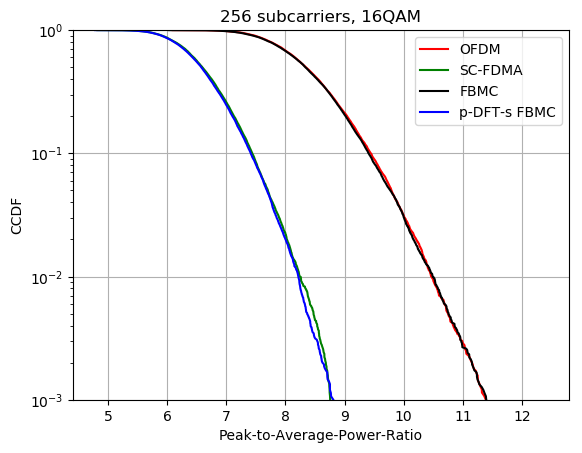
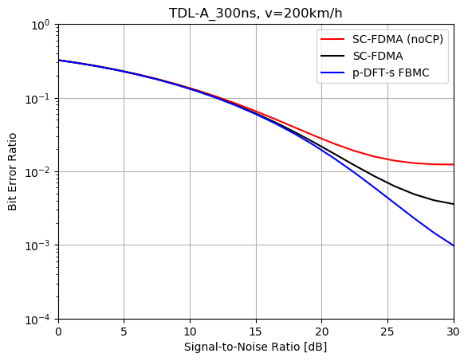
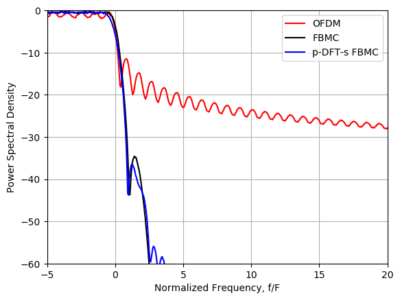
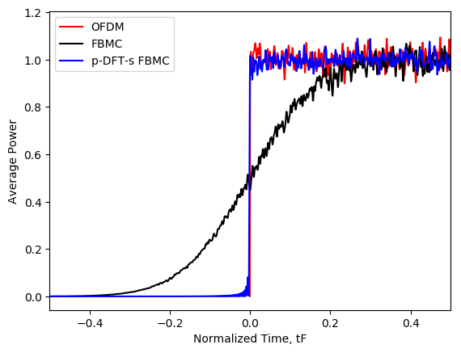
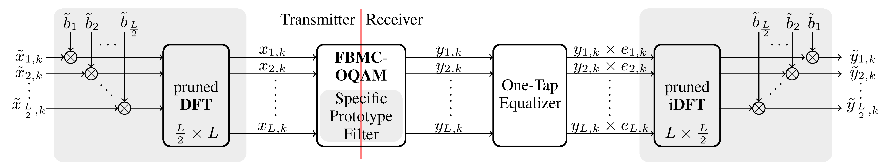

# Pruned DFT spread FBMC

Pruned DFT spread FBMC is a novel modulation scheme with the remarkable properties of a low PAPR, low latency transmissions and a high spectral efficiency.
It is closely related to FBMC, OFDM and SC-FDMA and I first proposed it in my [PhD thesis](http://publik.tuwien.ac.at/files/publik_265168.pdf), see Chapter 6. A more detailed description is currently under review in IEEE Transactions on Communications.  

The Python script simulates a pruned DFT spread FBMC transmission over a doubly-selective channel (time-variant multipath propagation) and compares the performance to OFDM, SC-FDMA and FBMC.

Furthermore, the included classes (QAM, DoublySelectiveChannel, OFDM, FBMC) can also be reused in future projects.

## Usage

Just run **Simulation.py** in Python. 

Requires the packages: numpy, scipy(sparse), matplotlib, time and mpl_toolkits.mplot3d.  

## Simulation Results* 
\* for "nr_rep = 1000"

### Pruned DFT spread FBMC has the same PAPR as SC-FDMA:

----------
### Pruned DFT spread FBMC outperforms SC-FDMA in doubly-selective channels:

Note that pruned DFT spread FBMC does not require a CP and thus has a higher data rate than conventional SC-FDMA.

----------
### Pruned DFT spread FBMC has superior spectral properties, comparable to FBMC: 

----------
### Pruned DFT spread FBMC dramatically reduces the ramp-up and ramp-down period of FBMC:

## Block Diagram 

### Pruned DFT spead FBMC at symbol-time-position *k*

Note that the absolute time position of symbol *x**l*,*k* is *kT* and the absolute frequency position *l F*. Furthermore, the time-frequency spacing is *TF*=1/2. The total number of subcarriers is denoted by *L*.  

## References
- R. Nissel, [“Filter bank multicarrier modulation for future wireless systems”](http://publik.tuwien.ac.at/files/publik_265168.pdf), Dissertation, TU Wien, 2017.
- R. Nissel and M. Rupp, “Pruned DFT spread FBMC: low PAPR, low latency, high spectral efficiency”, submitted to IEEE Transactions on Communications, not publicly available yet.

